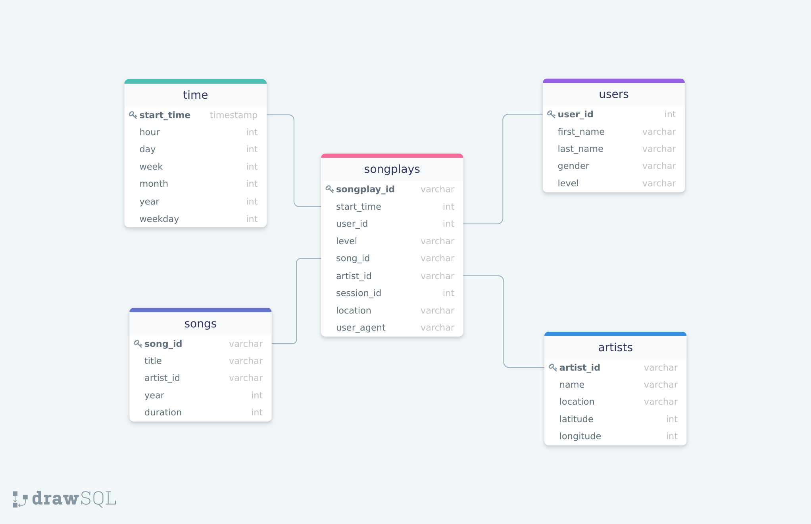

# Sparkify: Data Ingest
The process of this pipeline cleanse data from json inputs, and transfers it to a postgress data warehouse under a STAR Schema.

A STAR schema is appropiate as several facts are extracted from user logs, and various analytical processes will be built on top of this information.

The goal of this pipeline is to enable the business to understand user trends and to inform strategic and product development decisions. Analyst will be able to answer questions such as:
* What was the most popular song last month?
* How many average ctive users are there on weekends vs weekdays?
* Which ones are "growth" regions, and "mature" regions, in terms of user growth volumes?

* Fact Table
1. songplays - records in log data associated with song plays i.e. records with page NextSong
    
    possible pages as of 10-May-2020 are: **['NextSong', 'Home', 'Help', 'Login', 'Logout', 'About', 'Downgrade', 'Settings']**

* Dimension Tables
1. users - users in the app
2. songs - songs in music database
3. artists - artists in music database
4. time - timestamps of records in songplays broken down into specific units

## ETL Process
The ETL Process assumes that the tables have already been created, with the correct schema.

In addition, it expects two input paths:

**data/song_data**: contains song and artist information

| artist_id      | artist_latitude | artist_location | artist_longitude | artist_name | duration | num_songs | song_id | title | year
| ----------- | ----------- | ----------- | ----------- | ----------- | ----------- | ----------- | ----------- | ----------- | ----------- |
| AR8IEZO1187B99055E       | NaN | | NaN | Marc Shaiman | 149.86404 | 1 | SOINLJW12A8C13314C | City Slicker | 2008

**data/log_data**: contains user activity logs

| artist      | auth | firstName | gender | itemInSession | lastName | length | level | location | method | page | registration | sessionId | song | status | ts | userAgent | userId
| ----------- | ----------- | ----------- | ----------- | ----------- | ----------- | ----------- | ----------- | ----------- | ----------- | ----------- | ----------- | ----------- | ----------- | ----------- | ----------- | ----------- | ----------- |
Sydney Youngblood       | Logged In | Jacob | M | 53 | Klein | 238.07955 | paid | Tampa-St. Petersburg-Clearwater, FL | PUT |NextSong | 1.540558e+12 | 954 | Ain't No SunshinE | 200 | 1543449657796 | "Mozilla/5.0 (Macintosh; Intel Mac OS X 10_9_4... | 73

## Run Pipeline
**Prerequisites**:
1. Define schema of tables on sql_queries.py

**Requisites**:
1. Execute run.sh script - it will perform below actions:

    1.1. Create table through create_tables.py
    
    1.2. Run ETL on etl.py